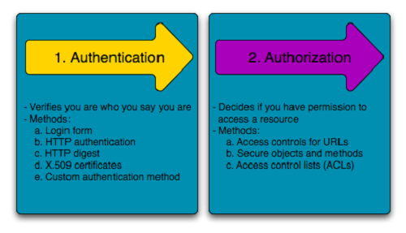

# Spring Security Architecture  

Application security boils down to two more or less independent problems: 
1- authentication (who are you?) 
2- authorization (what are you allowed to do?)

Authentication  
The main strategy interface for authentication is AuthenticationManager  
```
public interface AuthenticationManager {

Authentication authenticate(Authentication authentication)
throws AuthenticationException;
}
```  
An AuthenticationManager can do one of 3 things in its authenticate() method:  
Return an Authentication (normally with authenticated=true) if it can verify that the input represents a valid principal.  
Throw an AuthenticationException if it believes that the input represents an invalid principal.  
Return null if it cannot decide.

#### Authorization  

Once authentication is successful, we can move on to authorization, and the core strategy here is AccessDecisionManager.  
There are three implementations provided by the framework:  
- AccessDecisionVoter.  
- ProviderManager.  

    
  
#### Method Security  

For Spring Security, this is just a different type of “protected resource”. For users, it means the access rules are declared using the same format of ConfigAttribute strings (for example, roles or expressions) but in a different place in your code.  
The first step is to enable method security  

```  
@SpringBootApplication
@EnableGlobalMethodSecurity(securedEnabled = true)
public class SampleSecureApplication {
}
``` 

Then we can decorate the method resources directly:  

```
@Service
public class MyService {

  @Secured("ROLE_USER")
  public String secure() {
    return "Hello Security";
  }

}
```  
This example is a service with a secure method. If Spring creates a @Bean of this type, it is proxied and callers have to go through a security interceptor before the method is actually executed.  

There are other annotations that you can use on methods to enforce security constraints, notably @PreAuthorize and @PostAuthorize, which let you write expressions containing references to method parameters and return values, respectively.  
