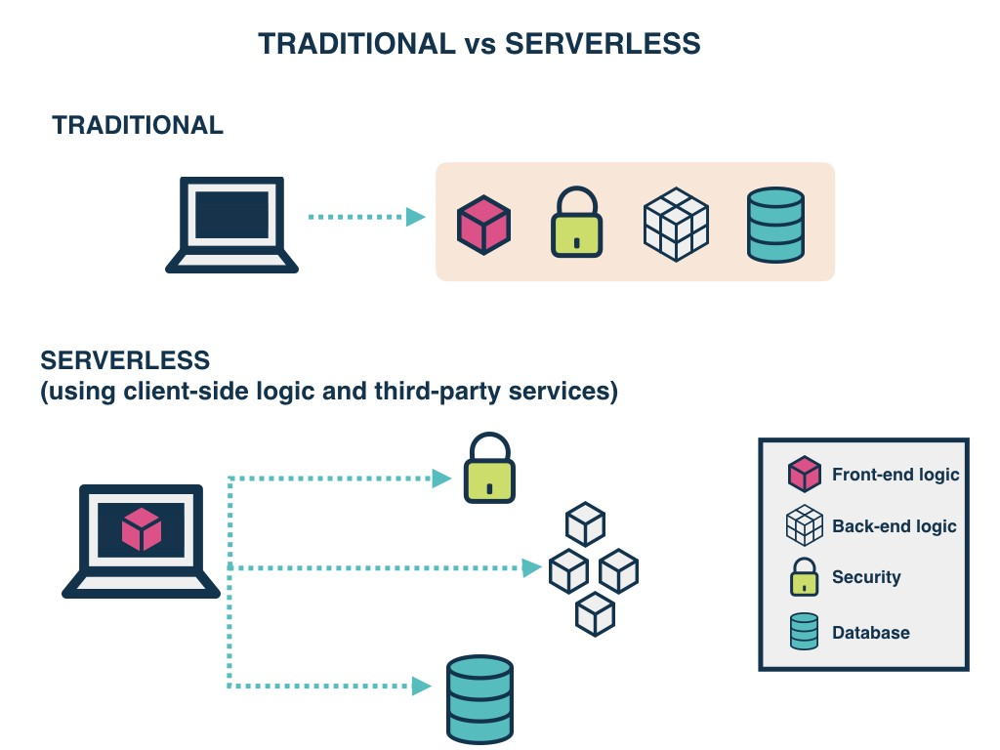

#### What is Serverless?  
Serverless is a cloud computing execution model where the cloud provider dynamically manages the allocation and provisioning of servers. A serverless application runs
in stateless compute containers that are event-triggered, ephemeral (may last for one invocation), and fully managed by the cloud provider.  

```  
Serverless applications are event-driven cloud-based systems where application development rely solely on a combination of third-party services,client-side logic
and cloud-hosted remote procedure calls (Functions as a Service).  
```  
#### Here are some of the currently available cloud services:  
- AWS Lambda  
- Google Cloud Functions  
- Azure Functions  
- IBM OpenWhisk  
- Alibaba Function Compute  

#### Traditional vs. Serverless Architecture  
  

- Pricing
One of the major advantages of using Serverless is reduced cost, for years the cost of provisioning servers and maintaining that 24x7 server team which blew a hole in your pocket is gone. The cost model of Serverless is execution-based: you’re charged for the number of executions.  
The winner here is Serverless Architecture.  

- Networking
The downside is that Serverless functions are accessed only as private APIs. To access these you must set up an API Gateway.  
The winner here is Traditional Architecture.  

- 3rd Party Dependencies
Most, if not all of your projects have external dependencies, they rely on libraries that are not built into the language or framework you use. You often use libraries with functionality that includes cryptography, image processing, etc., these libraries can be pretty heavy.  
The winner here is based on the context. For simple applications with few dependencies, Serverless is the winner; for anything more complex, Traditional Architecture is the winner.  

- Environments
Setting up different environments for Serverless is as easy as setting up a single environment. Given that it’s pay per execution, this is a large improvement over traditional servers, you no longer need to set up dev, staging, and production machines. Eventually you’d lose count of all the environments, at some point.
The winner here is Serverless Architecture.  

#### Functions as a Service (FaaS)  

FaaS is an implementation of Serverless architectures where engineers can deploy an individual function or a piece of business logic. They start within milliseconds (~100ms for AWS Lambda) and process individual requests within a 300-second timeout imposed by most cloud vendors.  

#### Principles of FaaS:
- Complete management of servers  
- Invocation based billing  
- Event-driven and instantaneously scalable  

#### Key properties of FaaS:  
- Independent, server-side, logical functions  
- Stateless  
- Ephemeral  
- Event-triggered  
- Scalable by default  
- Fully managed by a Cloud vendor  

#### The Serverless App  
A Serverless solution consists of a web server, Lambda functions (FaaS), security token service (STS), user authentication and database.  

  
- Client Application — The UI of your application is rendered client side in Modern Frontend Javascript App which allows us to use a simple, static web server.
- Web Server — Amazon S3 provides a robust and simple web server. All of the static HTML, CSS and JS files for our application can be served from S3.
- Lambda functions (FaaS) — They are the key enablers in Serverless architecture. Some popular examples of FaaS are AWS Lambda, Google Cloud Functions and Microsoft Azure Functions. AWS Lambda is used in this framework. The application services for logging in and accessing data will be built as Lambda functions. These functions will read and write from your database and provide JSON responses.
- Security Token Service (STS) — generates temporary AWS credentials (API key and secret key) for users of the application. These temporary credentials are used by the client application to invoke the AWS API (and thus invoke Lambda).
- User Authentication — AWS Cognito is an identity service which is integrated with AWS Lambda. With Amazon Cognito, you can easily add user sign-up and sign-in to your mobile and web apps. It also has the options to authenticate users through social identity providers such as Facebook, Twitter or Amazon, with SAML identity solutions, or using your own identity system.
- Database — AWS DynamoDB provides a fully managed NoSQL database. DynamoDB is not essential for a serverless application but is used as an example here.  

#### Benefits of Serverless Architecture  

- From business perspective
1- The cost incurred by a serverless application
2- Process agility
3- Cost of hiring backend infrastructure engineers goes down.
4- Reduced operational costs  

- From developer perspective
1- Reduced liability, no backend infrastructure to be responsible for.
2- Zero system administration.
3- Easier operational management.
4- Fosters adoption of Nanoservices, Microservices, SOA Principles.
5- Faster set up.
6- Scalable, no need to worry about the number of concurrent requests.
7- Monitoring out of the box.
8- Fosters innovation.  

- From user perspective
1- If businesses are using that competitive edge to ship features faster, then customers are receiving new features quicker than before.
2- It is possible that users can more easily provide their own storage backend(i.e Dropbox, Google Drive).
3- It’s more likely that these kinds of apps may offer client-side caching, which provides a better offline experience.  

#### Drawbacks of Serverless Architecture  

- From business perspective
1- Reduced overall control.
2- Vendor lock-in requires more trust for a third-party provider.
3- Additional exposure to risk requires more trust for a third party provider.
4- Security risk.  

- From developer perspective
1- Immature technology results in component fragmentation, unclear best-practices.
2- Architectural complexity.
3- The discipline required against function sprawl.  

- From user perspective
Unless architected correctly, an app could provide a poor user experience as a result of increased request latency.  

#### Serverless Frameworks  
Serverless platforms need infrastructures where they can be executed, provider agnostic frameworks provide a platform agnostic way to define and deploy Serverless code on various cloud platforms or commercial services.

- Serverless Framework (Javascript, Python, Golang)
- Apex (Javascript)
- ClaudiaJS (Javascript)
- Sparta (Golang)
- Gordon (Javascript)
- Zappa (Python)
- Up (Javascript, Python, Golang, Crystal)  

# API (GRAPHQL)

#### Data modeling
Amplify automatically creates Amazon DynamoDB database tables for GraphQL types annotated with the @model directive in your GraphQL schema. You can create relations between the data models via the @hasOne, @hasMany, @belongsTo, and @manyToMany directives.  

#### Setup database tables
The following GraphQL schema automatically creates a database table for "Todo". @model will also automatically add an id field as a primary key to the database table. See Configure a primary key to learn how to customize the primary key.  
```
type Todo @model {
  content: String
}
``` 
The Amplify CLI generates the Todo database table upon amplify push and generates a GraphQL API to perform create, read, update, delete, and list operations for the Todo model.

In addition, @model also adds the helper fields createdAt and updatedAt to your type. The values for those fields are read-only by clients unless explicitly overwritten. See Customize creation and update timestamps to learn more.  

#### Configure a primary key
Every GraphQL type with the @model directive will automatically have an id field set as the primary key.  

```
type Todo @model {
  todoId: ID! @primaryKey
  content: String
}
```  
#### Configure a secondary index
Amplify uses Amazon DynamoDB tables as the underlying data source for @model types. For key-value databases, it is critical to model your access patterns with "secondary indexes". Use the @index directive to configure a secondary index.  

- Amazon DynamoDB: is a key-value and document database that delivers single-digit millisecond performance at any scale but making it work for your access patterns requires a bit of forethought. DynamoDB query operations may use at most two attributes to efficiently query data. The first query argument passed to a query (the hash key) must use strict equality and the second attribute (the sort key) may use gt, ge, lt, le, eq, beginsWith, and between. DynamoDB can effectively implement a wide variety of access patterns that are powerful enough for the majority of applications.  

#### Setup relationships between models
Create "has one", "has many", "belongs to", and "many to many" relationships between @model types.  

| Relationship | Description |
| ----------- | ----------- |
| Header | Title |
| @hasOne| Create a one-directional one-to-one relationship between two models. For example, a Project "has one" Team. This allows you to query the team from the project record. |
| @hasMany| Create a one-directional one-to-many relationship between two models. For example, a Post has many comments. This allows you to query all the comments from the post record. |
| @belongsTo| Use a "belongs to" relationship to make a "has one" or "has many" relationship bi-directional. For example, a Project has one Team and a Team belongs to a Project. This allows you to query the team from the project record and vice versa. |
| @manyToMany| Configures a "join table" between two models to facilitate a many-to-many relationship. For example, a Blog has many Tags and a Tag has many Blogs. |


