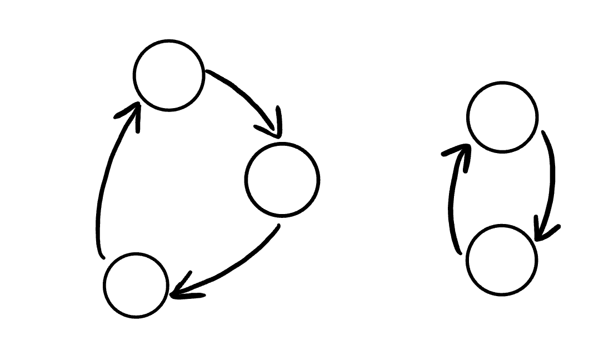
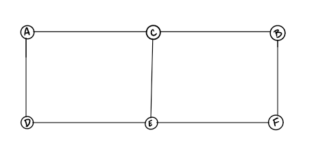

# Graphs

A graph is a non-linear data structure that can be looked at as a collection of vertices (or nodes) potentially connected by line segments named edges.  

#### some common terminology used when working with Graphs:  

- Vertex
- Edge
- Neighbor
- Degree  

#### Directed vs Undirected  

- Undirected Graphs  

An Undirected Graph is a graph where each edge is undirected or bi-directional. This means that the undirected graph does not move in any direction.  
  

- Directed Graphs (Digraph)  

A Directed Graph also called a Digraph is a graph where every edge is directed , unlike an undirected graph, a Digraph has direction. Each node is directed at another node with a specific requirement of what node should be referenced next.  
 

#### Complete vs Connected vs Disconnected  

There are many different types of graphs. This depends on how connected the graphs are to other node/vertices.  

The three different types are:  

- Complete Graphs  

A complete graph is when all nodes are connected to all other nodes.  
 

- Connected
A connected graph is graph that has all of vertices/nodes have at least one edge.  
 

- Disconnected
A disconnected graph is a graph where some vertices may not have edges.  
  

#### Acyclic vs Cyclic  

In addition to undirected and directed graphs, we also have acyclic and cyclic graphs.  

- Acyclic Graph

An acyclic graph is a directed graph without cycles.  
A cycle is when a node can be traversed through and potentially end up back at itself.  
Here is an example of 3 acyclic graphs: 

 

- Cyclic Graphs  

A Cyclic graph is a graph that has cycles.  
A cycle is defined as a path of a positive length that starts and ends at the same vertex.  
Here is an example of a two different cyclic graph:  

  

#### Graph Representation  

We represent graphs through:  

We will represent the following graph as both an Adjacency Matrix and an Adjacency List:  

 

We can represent graphs in two ways :

- Adjacency Matrix  

The matrix representation means that there is an edge connecting x-element with y-element if (x,y) index was 1 and not if it was 0  

  

- Adjacency List  

An adjacency list is a collection of linked lists or array that lists all of the other vertices that are connected.  

  

# Real World Uses of Graphs  

Graphs are extremely popular when it comes to it’s uses. Here are just a few examples of graphs in use:  

- GPS and Mapping  
- Driving Directions  
- Social Networks  
- Airline Traffic  
- Netflix uses graphs for suggestions of products  