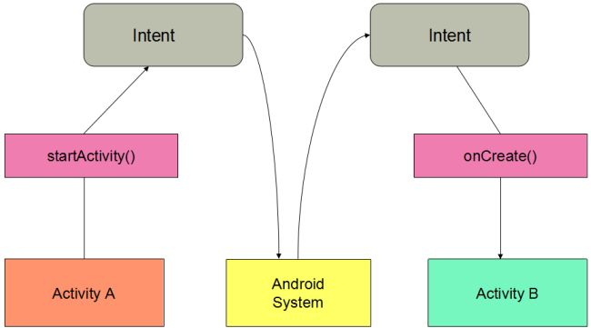

# Read 38 - Notifications 

#### How To Allow other Apps to Start Your Activity 

To allow other apps to start your activity in this way, you need to add an <intent-filter> element in your manifest file for the corresponding <activity> element.  

- Add an Intent Filter  

The system may send a given Intent to an activity if that activity has an intent filter fulfills the following criteria of the Intent object:  

1- Action:  
Specify this in your intent filter with the <action> element. The value you specify in this element must be the full string name for the action, instead of the API constant (see the examples below).  

2- Data:  
A description of the data associated with the intent.Specify this in your intent filter with the <data> element.  

3- Category:  
Provides an additional way to characterize the activity handling the intent, usually related to the user gesture or location from which it's started. 
Specify this in your intent filter with the <category> element.  


#### Handle the Intent in Your Activity  

As your activity starts, call getIntent() to retrieve the Intent that started the activity.  
```
@Override
protected void onCreate(Bundle savedInstanceState) {
    super.onCreate(savedInstanceState);

    setContentView(R.layout.main);

    // Get the intent that started this activity
    Intent intent = getIntent();
    Uri data = intent.getData();

    // Figure out what to do based on the intent type
    if (intent.getType().indexOf("image/") != -1) {
        // Handle intents with image data ...
    } else if (intent.getType().equals("text/plain")) {
        // Handle intents with text ...
    }
}
```  

#### Return a Result  

If you want to return a result to the activity that invoked yours, simply call setResult() and send the result code and result Intent. Then when the operation is done call finish(). You must always specify a result code with the result. Generally, it's either RESULT_OK or RESULT_CANCELED.  
  
```
// Create intent to deliver some kind of result data
Intent result = new Intent("com.example.RESULT_ACTION", Uri.parse("content://result_uri"));
setResult(Activity.RESULT_OK, result);
finish();
```

#### Intents and Intent Filters  

An Intent is a messaging object you can use to request an action from another app component. Although intents facilitate communication between components in several ways, there are three fundamental use cases:  

1- Starting an activity "startActivity()"
2- Starting a service  "startService()"
3- Delivering a broadcast "sendBroadcast()"  

#### Intent types  

There are two types of intents:  

Explicit intents specify which application will satisfy the intent, by supplying either the target app's package name or a fully-qualified component class name. You'll typically use an explicit intent to start a component in your own app, because you know the class name of the activity or service you want to start. For example, you might start a new activity within your app in response to a user action, or start a service to download a file in the background.  

Implicit intents do not name a specific component, but instead declare a general action to perform, which allows a component from another app to handle it. For example, if you want to show the user a location on a map, you can use an implicit intent to request that another capable app show a specified location on a map.  

 
